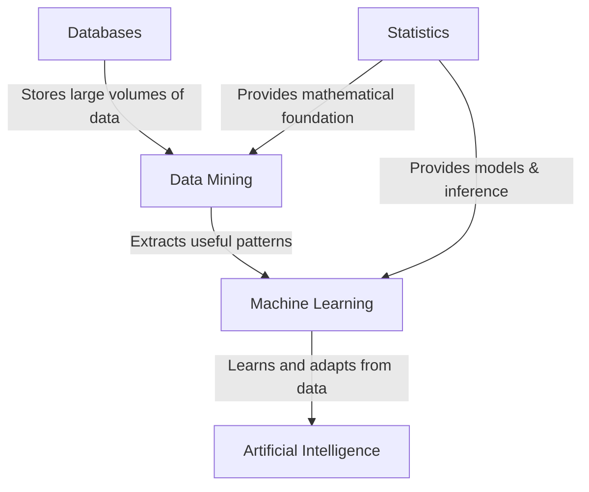
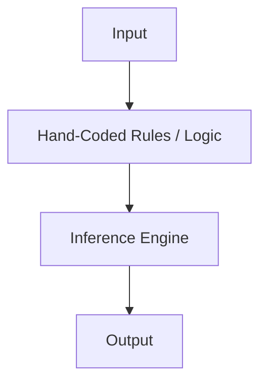
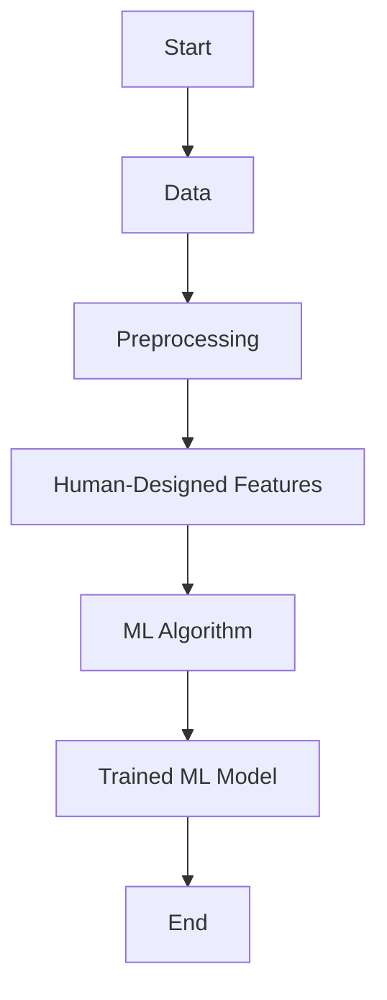
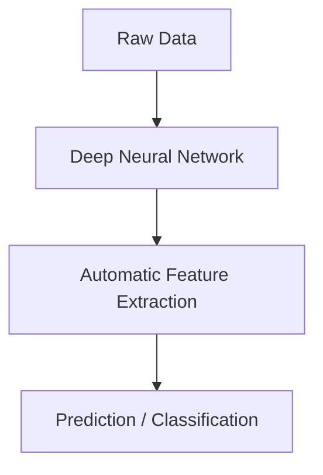

# Introduction to Machine Learning

## What is Machine Learning?
At the core of computer science, we learnt the concepts of **algorithm**.  Algorithm is a **well define computational procedure** that **takes some value**, or set of values, as an **input** and **produces some value**, or set of values, as **output** in a finite amount of time. 

**Algorithm**
: A sequence of computational steps (instructions) that transform input into the correct intended output.

Algorithms are used to solved many tasks, with it concrete steps and instructions. For some task, however, human can't made an algorithm to solve it. Some of these tasks are tasks that human being can solve it effortlessly without aware how to do them(i.e. photo recognition, move in crowded room, and play chess). 

In machine learning the idea is to learn to do these types of things.

### Definition of Machine Learning

Arthur Samuel (1959):
: ***Machine Learning** is a field of study that gives computers the ability to learn without being explicitly programmed.*

Tom Mitchell (1998):
: ***Machine learning** is the study of algorithms that improve their performance **$P$**, at some task **$T$**, with experience **$E$**. A well-defined learning task is given by: $<P, T, E>$*

Ethem Alpaydin (2014):
: ***Machine learning** is programming computers to optimize a performance criterion using example data or past experience.*

> [!NOTE]
> What ⟨P, T, E⟩ Means?
> - **Hand-written recognition**  
>   - **T**: Recognizing hand-written words  
>   - **P**: Percentage of words correctly classified  
>   - **E**: Database of human-labeled images of handwritten words  
> - **Spam detection**  
>   - **T**: Classify email messages as spam or legitimate  
>   - **P**: Percentage of email messages correctly classified  
>   - **E**: Database of emails with human-given labels  
> - **Credit approval**  
>   - **T**: Classify credit card applications as approved or rejected  
>   - **P**: Percentage of credit card applications correctly classified  
>   - **E**: Database of credit card applications with human-given labels  

Machine learning represents a shift in how we approach problem-solving. Instead of relying on fixed algorithms, it begins with a **general model**—a flexible framework with many adjustable parameters. Through exposure to data, these parameters are fine-tuned, allowing the model to specialize and perform specific tasks effectively.

This shift is crucial because, in today’s world, **data is abundant while explicit algorithms are scarce**. Every action we take in the digital space—purchasing products, streaming movies, browsing pages, or writing blogs—contributes to an immense pool of data. As both **generators and consumers of data**, people now expect systems to understand their needs and predict their interests.

When such methods are applied to massive datasets, the process is called **data mining**. Like mining precious metals from tons of raw ore, data mining extracts valuable insights and predictive models from raw information. Yet machine learning is not confined to databases—it is an integral branch of **artificial intelligence**. A truly intelligent system must **adapt to changing environments**, learning continuously rather than relying solely on preprogrammed solutions.

The applications are vast: **computer vision, speech recognition, robotics**, and more. Take face recognition as an example. Humans perform this task effortlessly despite variations in lighting, pose, or hairstyle. But we cannot explicitly articulate how we do it, which makes writing a program nearly impossible. Machine learning solves this by recognizing that faces are structured patterns. By learning from sample images, it captures each person’s unique pattern and uses it for recognition—an elegant example of **pattern recognition** in action.

In essence, machine learning bridges the gap between raw data and intelligent behavior. It enables systems to discover patterns, adapt to uncertainty, and provide solutions where explicit programming falls short.

### **The Gold Mine Analogy**

* **Databases → The Gold Mine**
  Think of a database as a big gold mine filled with raw materials: gold nuggets, stones, and dirt all mixed together. It’s where all the valuable information (data) is stored, but in its raw form, it’s not immediately useful.

* **Data Mining → The Miner**
  A miner digs into the mine, separating out the dirt from the gold. Data mining is like sifting through the raw pile of data to find the useful patterns and hidden gems.

* **Statistics → The Toolkit**
  The miner doesn’t work with bare hands—he has tools like pickaxes, sieves, and measuring devices. These tools are statistics: formulas and methods that help separate signal from noise, measure patterns, and validate findings.

* **Machine Learning → The Jeweler**
  Once the miner finds the gold nuggets, the jeweler shapes them into rings, necklaces, and coins. Machine learning takes the patterns extracted from data and **builds predictive models**, transforming raw insights into something actionable and specialized.

* **Artificial Intelligence → The Marketplace**
  Finally, the marketplace is where these jewels are used to create value. AI uses the crafted jewelry (machine learning models) to make decisions, adapt to changes, and interact intelligently with people in real life—whether it’s recognizing a face, translating speech, or driving a car.

- **Databases:** are the raw source of data.
- **Data Mining:** extracts valuable insights and patterns from databases.
- **Machine Learning:** builds predictive and adaptive models, often leveraging insights from data mining.
- **Artificial Intelligence:** is the broader field that uses machine learning to enable intelligent behavior.
- **Statistics:** underpins both data mining and machine learning by providing the mathematical and inferential foundation.

At its core, **machine learning** is about programming computers to **optimize a performance criterion** by using **example data or past experience**. We begin with a model that is flexible but incomplete—it has parameters waiting to be adjusted. The **learning process** is the execution of algorithms that tune these parameters using training data, with the goal of improving performance.

A learned model can serve different purposes:

* **Predictive**, when it aims to forecast future outcomes.
* **Descriptive**, when it aims to extract knowledge and insights from existing data.
* In many cases, it can be both.

Machine learning is deeply tied to **statistics**, since the essence of learning is **drawing inferences from samples**. However, it is also a branch of **computer science**, and its computational side plays a crucial role in practice:

1. **During training**, efficient algorithms are needed to solve complex optimization problems and handle the **massive scale of data**.
2. **After training**, the learned model must be represented and implemented efficiently so that inference (making predictions or decisions) can be carried out quickly.

In real-world applications, efficiency is often just as important as accuracy. A model that predicts well but is too slow or memory-intensive may be impractical. Thus, **space and time complexity** become central concerns, making machine learning a balanced discipline at the intersection of **statistics and computer science**.

## History of Machine Learning
The story of Artificial Intelligence has unfolded in waves, each driven by a different way of thinking about how machines can learn and act intelligently.

In the **1950s**, AI was born from bold optimism. Programs like Samuel’s checker player and Selfridge’s Pandemonium suggested that machines could mimic aspects of human learning. At this stage, intelligence was hand-crafted: rules and logic explicitly written by humans. This was the era of **symbolic AI**, where knowledge lived in code, not data.

By the **1960s**, a new idea emerged — **neural networks**. The perceptron promised machines that could learn patterns directly from examples. It was an exciting step toward data-driven intelligence, though Minsky and Papert’s proof of its limitations cooled enthusiasm. Still, the seed of learning from data had been planted.

The **1970s** shifted focus back to symbolic approaches. **Expert systems** flourished, diagnosing diseases or classifying crops based on carefully encoded rules. Decision trees like Quinlan’s ID3 demonstrated that algorithms could construct knowledge structures automatically. Yet these systems suffered from the “knowledge acquisition bottleneck”: the difficulty of capturing all the rules humans know.

A major transformation arrived in the **2000s**, when AI leaned into mathematics and statistics. Instead of manually encoding rules, researchers developed **statistical learning methods**: support vector machines, graphical models, transfer learning. Here, learning meant optimization, probability, and making inferences from data. AI started to prove itself in practical tasks like spam detection, speech, and robotics.

The **2010s** brought the deep learning revolution. With access to massive datasets and the computational power of GPUs, **multi-layer neural networks** suddenly became practical. These networks could learn hierarchical patterns directly from raw inputs — edges becoming shapes, shapes becoming objects in vision tasks; sounds becoming phonemes, words, and sentences in speech recognition. Deep learning didn’t just extend machine learning, it transformed it, driving today’s AI boom across vision, language, and decision-making.

In essence, the journey has been one of **increasing abstraction**:

* From rules written by hand,
* to statistical models trained on data,
* to deep architectures that discover patterns humans cannot easily describe.

This progression underscores a simple but powerful theme: AI evolves not only through new ideas, but through finding better ways for machines to **learn from experience**.

## Machine Learning Approaches

### Traditional AI

Traditional AI (often called **symbolic AI**) relied on **explicitly programmed rules**. Humans defined knowledge as “if–then” logic, and the system followed those rules. The power of this approach was in **reasoning and logic**, but its weakness was brittleness: it struggled when faced with uncertainty, noise, or problems too complex for hand-crafted rules.

### Modern Machine Learning Approach (Artificial Neural Networks, ANN)

Modern machine learning shifted from **rules to data**. Instead of telling the computer *how* to solve a problem, we provide **examples (data)** and let the algorithm learn the patterns.

* **Feature engineering** is a crucial step: humans decide which features (e.g., edges in an image, keywords in text) the algorithm should pay attention to.
* Algorithms (e.g., decision trees, SVMs, shallow neural networks) then learn to map input features to outputs.

### Deep Learning Approach

Deep learning, a subset of ML, removes the heavy reliance on human-designed features. Instead, **multi-layer neural networks** automatically learn hierarchical representations from raw data.

* Early layers learn **simple features** (edges, sounds, letters).
* Middle layers combine them into **patterns** (shapes, phonemes, words).
* Deeper layers capture **abstract concepts** (objects, sentences, meaning).

This approach excels with large datasets and computational power, enabling breakthroughs in **computer vision, speech recognition, and natural language processing**.

## Types of Machine Learning

## Machine Learning Application

## Public Datasets

