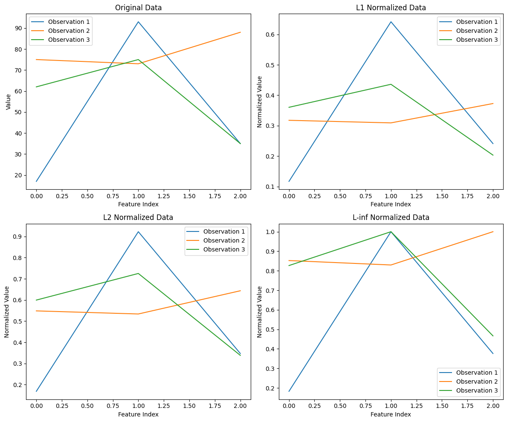
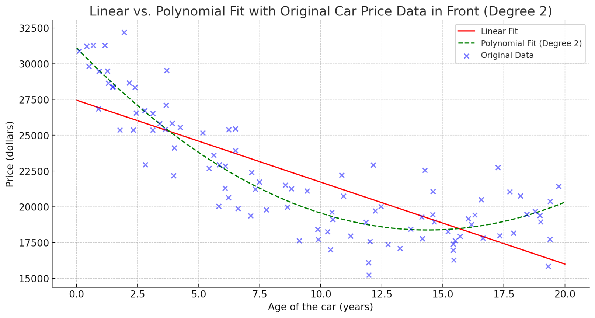

# Data Pre-Processing

Data preprocessing is the crucial first step in any machine learning (ML) pipeline. It involves cleaning and transforming raw, real-world data into a clean, structured format that is suitable for a machine learning model. Think of it like a chef preparing ingredients (washing, chopping, measuring) before starting to cook. Without proper preparation, the final dish (the model's prediction) will be poor, no matter how good the recipe (the algorithm) is. This process directly impacts the accuracy, efficiency, and reliability of your ML model.

Data Pre-Processing
: is a step in machine learning that transform the original data to a new form to facilitate the next steps.


**The main goal is to facilitate the next step of the ML workflow by making the data:**
* **Complete:** Free of missing values.
* **Consistent:** Uniform in notation and format.
* **Understandable:** In a numerical format that algorithms can process.
* **Well-scaled:** Features are on a similar scale to prevent bias.
Of course! Here’s a breakdown of why data preprocessing is a critical step in any machine learning project.

## Why Data Preprocessing is Important

Think of raw data as rough, uncut diamonds. Before they can be used, they need to be cleaned, cut, and polished. Data preprocessing is that essential polishing process for your data. Without it, your machine learning model will likely be inaccurate and unreliable.

Here’s why it's so crucial:

### Data Comes in Different Forms and Structures
Real-world data is messy and inconsistent. It can come from different sources, each with its own format.

* **Different Structures:** You might have data from a database, a CSV file, a text log, or a web scraper. These sources don't follow a single, clean structure.
* **Different Storage Methods:** Data might have inconsistencies like "New York," "NY," and "N.Y." for the same city, or dates in different formats like "10/09/2025" vs. "Sep 10, 2025".

Preprocessing **standardizes** this data into a clean, consistent, and structured format (usually a table or matrix) that machine learning algorithms can actually understand and use.

### Features Can Be on Wildly Different Scales
Data features are often measured in different units and have different ranges.

* **Different Scales:** Imagine a dataset with a person's **age** (e.g., 20-65) and their **salary** (e.g., \$40,000-\$150,000). The salary feature has a much larger range and magnitude.
* **Different Units:** One feature might be in kilograms while another is in centimeters.

Algorithms that calculate distances (like K-Nearest Neighbors) or use gradient descent (like neural networks) will be **biased** toward features with larger scales. They will mistakenly think the salary feature is more important than the age feature simply because its numbers are bigger. **Scaling** and **standardization** fix this by putting all features on a level playing field.

### Data May Contain Outliers
An **outlier** is a data point that behaves very differently from the rest of the data. This could be a measurement error or a rare but real event.

Outliers can seriously skew statistical calculations like the mean and standard deviation. In a model like linear regression, a single outlier can pull the entire best-fit line towards it, making the model inaccurate for the majority of the data.

Preprocessing helps you **detect and handle** these outliers, either by removing them or adjusting their value, to prevent them from corrupting your model.

### Data Often Has Missing Values
It's very common for datasets to have empty cells or missing entries (`NaN`s).

Most machine learning algorithms simply **cannot run** with missing data; they will crash or throw an error. They are built on mathematical operations that don't know how to handle an empty value.

Preprocessing is necessary to **handle these missing values**, either by removing the rows/columns with missing data or by intelligently filling them in (a process called **imputation**).

## Types of Data Pre-Processing Method
### Scaling (Min-Max Scaling)

Some Machine Learning algorithm assume all features are on a same scale. **Scaling** transforms your data by rescaling it to a fixed range, typically **[0, 1]** or **[-1, 1]**. 

Algorithms that compute distances between data points (like **K-Nearest Neighbors (KNN)**) or use gradient descent (like **Linear Regression** and **Neural Networks**) are sensitive to the scale of the features. A feature with a large range (e.g., salary from \$30,000 to \$200,000) will dominate a feature with a small range (e.g., age from 20 to 65), leading the model to believe the larger-scaled feature is more important. Scaling puts all features on a level playing field.

The most common method is Min-Max scaling. The technique rescale feature such that it falls on $[a,b]$.

Using the classic mathematics line function we got

<!-- Picture of the graph-->

$$\begin{align}
\frac{x'-a}{b-a} &= \frac{x-\min{(x)}}{\max{(x)}-\min{(x)}} \\
x'&= a+\frac{(x-\min{(x)})(b-a)}{\max{(x)}-\min{(x)}} 
\end{align}$$

It's useful when you know the approximate upper and lower bounds of your data and your data distribution is not Gaussian (not a bell curve). However, it's very sensitive to outliers. A single extreme outlier can squash all the other data points into a very small range.

#### Example

$\text{Let X}=[15, 57,36,88,37]$ scale with $[0,1]$

First, we need to find the minimum ($X_{min}$) and maximum ($X_{max}$) values in your data.

* $X = [15, 57, 36, 88, 37]$
* The **minimum** value ($X_{min}$) is **15**.
* The **maximum** value ($X_{max}$) is **88**.

Next, we apply the Min-Max scaling formula to each number in your list:

$$X_{scaled} = \frac{X_{original} - X_{min}}{X_{max} - X_{min}}$$

**For 15:**
$$\frac{15 - 15}{88 - 15} = \frac{0}{73} = 0$$
**For 57:**
    $$\frac{57 - 15}{88 - 15} = \frac{42}{73} \approx 0.575$$
**For 36:**
    $$\frac{36 - 15}{88 - 15} = \frac{21}{73} \approx 0.288$$
**For 88:**
    $$\frac{88 - 15}{88 - 15} = \frac{73}{73} = 1$$
**For 37:**
    $$\frac{37 - 15}{88 - 15} = \frac{22}{73} \approx 0.301$$


After scaling, the original list $X = [15, 57, 36, 88, 37]$ becomes:

$X_{scaled} = [0, 0.575, 0.288, 1, 0.301]$

#### Implementation

The provided Python code uses the `MinMaxScaler` from the popular `scikit-learn` library to perform Min-Max scaling on a randomly generated dataset.

```python
# Prepare Data
import numpy as np
x = np.round(100*np.random.rand(5,3))
print(x)

# Min Max Scaler
from sklearn.preprocessing import MinMaxScaler
scaler = MinMaxScaler()
scaler.fit(x)
xs = scaler.transform(x)

# Print result
print(xs)
```
##### **How it Works**

The process involves two main steps: `fit` and `transform`.

1.  **`scaler.fit(x)`**: In this step, the scaler "learns" the properties of your data. Specifically, it analyzes **each column independently** to find the minimum ($X_{min}$) and maximum ($X_{max}$) value within that column.

    * **Column 1:** `[66, 8, 91, 84, 28]` -> Min is **8**, Max is **91**.
    * **Column 2:** `[35, 65, 14, 26, 72]` -> Min is **14**, Max is **72**.
    * **Column 3:** `[57, 60, 54, 14, 89]` -> Min is **14**, Max is **89**.

2.  **`scaler.transform(x)`**: Now, the scaler applies the Min-Max formula to every value in the dataset, using the min and max it found for that value's specific column.

    The formula is:
    $$X_{scaled} = \frac{X_{original} - X_{min}}{X_{max} - X_{min}}$$

##### Output
This is the data before scaling.
```
[[66. 35. 57.]
 [ 8. 65. 60.]
 [91. 14. 54.]
 [84. 26. 14.]
 [28. 72. 89.]]
```
This is the data after scaling.
```
[[0.69879518 0.36206897 0.57333333]
 [0.         0.87931034 0.61333333]
 [1.         0.         0.53333333]
 [0.91566265 0.20689655 0.        ]
 [0.24096386 1.         1.        ]]
```


> ![WARNING]
> Remember that MinMaxScaler automatically scaling it by column.

###### **Example Calculation (First Column)**

Let's manually calculate the scaled values for the first column `[66, 8, 91, 84, 28]` where $X_{min}=8$ and $X_{max}=91$.

* **For the value `66`:**

$X_{scaled} = \frac{66 - 8}{91 - 8} = \frac{58}{83} \approx 0.69879518$

* **For the value `8` (the minimum):**

$X_{scaled} = \frac{8 - 8}{91 - 8} = \frac{0}{83} = 0.0$

* **For the value `91` (the maximum):**

$X_{scaled} = \frac{91 - 8}{91 - 8} = \frac{83}{83} = 1.0$

The same logic is applied to the second and third columns using their respective min and max values. This process ensures that for each feature, the smallest value becomes **0**, the largest value becomes **1**, and all other values are scaled to a number between 0 and 1.

### Standardization (Z-score Normalization)

**Standardization** transforms your data so that it has a **mean ($\mu$) = 0** and a **standard deviation ($\sigma$) = 1**.

Like scaling, it's essential for distance-based and gradient descent algorithms. The key advantage of standardization is that it is **not sensitive to outliers**. Because it doesn't have a bounded range, an outlier won't have the same drastic squashing effect as in Min-Max scaling.

It calculates the "Z-score" for each data point. The formula is:

$$\begin{align}Z = \frac{x_i - \mu_x}{\sigma_x}\end{align}$$

Where:
* $x_i$ is the original value.
* $\mu_x$ is the mean of the feature column.
* $\sigma_x$ is the standard deviation of the feature column.

$$\begin{align}
\mu_x = \frac{\sum_{i=1}^{n} x_i}{n}
\end{align}$$

$$\begin{align}
\sigma_x = \sqrt{\frac{\sum_{i=1}^{N} (x_i - \mu_x)^2}{N}}
\end{align}$$

Standardization is the **default go-to** for most preprocessing needs, especially if your data follows a Gaussian distribution or if you suspect there are outliers.

#### Implementation
This Python code demonstrates how to perform **Standardization** (also known as Z-score normalization) using the `scikit-learn` library. The goal is to rescale the data so that each feature (column) has a **mean ($\mu$) of 0** and a **standard deviation ($\sigma$) of 1**.

```python
# Generate data with 10 observations and 3 features
x = np.round(100*np.random.rand(10,3))
print(x)

# Calculate Standardization
from sklearn.preprocessing import StandardScaler
scaler = StandardScaler()
xs = scaler.fit_transform(x)
print(xs)
```

The `scaler.fit_transform(x)` method is a convenient shortcut that combines two essential steps:

1.  **`.fit()` (The Learning Step):** First, the `StandardScaler` analyzes your dataset `x` to learn its properties. For **each column independently**, it calculates two key statistics:
    * The **mean ($\mu$)**: The average value of that column.
    * The **standard deviation ($\sigma$)**: A measure of how spread out the data is from the mean.

2.  **`.transform()` (The Application Step):** Next, it goes through every value in the dataset and applies the standardization formula using the mean and standard deviation.

After this transformation, if you were to calculate the mean and standard deviation for any column in the output `xs`, you would find they are now **0** and **1**, respectively. This puts all features on the same scale, making them equally important to distance-based algorithms.

### Normalizing Observations
This is different from scaling/standardizing features. Normalization here applies to each observation (row), not each feature (column). It rescales each row so that it has a unit norm. 

**Normalizing an observation** is a data preprocessing technique that rescales an individual sample (i.e., a row in your dataset) so that it has a **unit norm** (a length or magnitude of 1).

This is fundamentally different from feature scaling (Min-Max) and standardization, which operate on **columns** (features). Normalization operates on **rows** (observations). 

This technique is especially common in **text processing** and certain clustering algorithms. It's used when the **direction** of the data vector is more important than its magnitude.

For example, when analyzing documents, you might care more about the relative frequency of words (the direction) than the total number of words in the document (the magnitude). Normalizing ensures that long and short documents are treated equally.

To transform a sample vector $x$ into a normalized vector $x'$, you divide each element of the vector by its norm, $\|x\|$.

The general formula is:
$$\begin{align}
x' = \frac{1}{\|x\|} x
\end{align}$$

#### Norms

Let's use a simple example sample to see how each norm works. Suppose we have one observation (sample) with three features: $x = [3, -4, 12]$

#### **L1 Norm (Manhattan Norm)**

The L1 norm is the sum of the absolute values of the elements. It's called the Manhattan norm because it represents the distance a taxi would travel on a grid (like the streets of Manhattan).

$$\begin{align}
\|x\|_1 = |x_1| + |x_2| + \dots + |x_n|
\end{align}$$

**Calculation for our example:**
    $$\|x\|_1 = |3| + |-4| + |12| = 3 + 4 + 12 = 19$$
**Normalization:**
    $$x' = \frac{1}{19} [3, -4, 12] = [\frac{3}{19}, \frac{-4}{19}, \frac{12}{19}] \approx [0.158, -0.211, 0.632]$$

#### **L2 Norm (Euclidean Norm)**

The L2 norm is the most common. It represents the straight-line distance from the origin to the data point (the "as-the-crow-flies" distance).

$$\begin{align}
\|x\|_2 = \sqrt{x_1^2 + x_2^2 + \dots + x_n^2}
\end{align}$$

**Calculation for our example:**
$$\|x\|_2 = \sqrt{3^2 + (-4)^2 + 12^2} = \sqrt{9 + 16 + 144} = \sqrt{169} = 13$$
**Normalization:**
$$x' = \frac{1}{13} [3, -4, 12] = [\frac{3}{13}, \frac{-4}{13}, \frac{12}{13}] \approx [0.231, -0.308, 0.923]$$

#### **L-inf Norm (Maximum Norm)**

The L-infinity norm is simply the largest absolute value among all the elements in the vector.

$$\begin{align}
\|x\|_{\infty} = \max(|x_1|, |x_2|, \dots, |x_n|)\end{align}$$
**Calculation for our example:**
$$\|x\|_{\infty} = \max(|3|, |-4|, |12|) = \max(3, 4, 12) = 12$$
**Normalization:**
$$x' = \frac{1}{12} [3, -4, 12] = [\frac{3}{12}, \frac{-4}{12}, \frac{12}{12}] = [0.25, -0.333, 1]$$



#### Implementation
```python
# Generate data with 10 observations and 3 features
x = np.round(100*np.random.rand(10,3))
print(x)

# Use L-1 norm
from sklearn.preprocessing import Normalizer
scaler = Normalizer(norm='l1')
xs_one = scaler.fit_transform(x)
print(xs_one)

# Use L-2 norm
from sklearn.preprocessing import Normalizer
scaler = Normalizer(norm='l2')
xs_two = scaler.fit_transform(x)
print(xs_two)

# Use L-inf norm
from sklearn.preprocessing import Normalizer
scaler = Normalizer(norm='max')
xs_inf = scaler.fit_transform(x)
print(xs_inf)
```

### Generating Polynomial Features

This technique creates new features by raising existing features to a power and creating interaction terms between features.



Many ML models, like Linear Regression, can only learn linear relationships. If the true relationship in your data is non-linear (e.g., quadratic), your model will perform poorly. By adding polynomial features, you allow a linear model to fit a more complex, non-linear function.

If you have features $[a, b]$, generating polynomial features of degree 2 would create a new set of features: $[1, a, b, a^2, ab, b^2]$. The term $ab$ is called an **interaction feature**.

> ![WARNING] 
> Using a high degree can lead to **overfitting**. The model becomes too complex and starts learning the noise in the training data, causing it to perform poorly on new, unseen data.

### Implementation
```python
# Generate data with 10 observations and 3 features
x = np.round(100*np.random.rand(3,3))
print(x)

# Generate polynomial feature of degree 2 from x
from sklearn.preprocessing import PolynomialFeatures
poly = PolynomialFeatures(degree=2)
xs = poly.fit_transform(x)
print(xs)
```


### Encoding Categorical Features

Machine learning algorithms require numerical input. Encoding is the process of converting categorical (text-based) data into numbers.

* **Nominal Data (No order):** For categories with no intrinsic order, like `['Red', 'Green', 'Blue']`.
    * **One-Hot Encoding:** This is the preferred method. It creates a new binary column for each category. For a given row, the column corresponding to its category will be `1`, and all other new columns will be `0`. This prevents the model from assuming a false order.
        * Example: `['Red']` becomes `[1, 0, 0]`, `['Green']` becomes `[0, 1, 0]`.

* **Ordinal Data (Has order):** For categories with a clear ranking, like `['Small', 'Medium', 'Large']` or `['Low', 'High']`.
    * **Label Encoding (or Ordinal Encoding):** This method assigns a unique integer to each category based on its rank.
        * Example: `['Small', 'Medium', 'Large']` can be mapped to `[0, 1, 2]`.

#### Implementation
```python
#Encoding categorical features
import pandas as pd
x={'Ans1':['l','m','l','h','m'],'Ans2':['a','sd','d','sa','n']}
df=pd.DataFrame(x)
df.head()

#encoding categorical data using sklearn LabelEncoder
dfm = df.copy()
mapper={'l':1,'m':2,'h':3,'sd':1,'d':2,'n':3,'a':4,'sa':5}
dfm.replace(mapper)

#encoding categorical data using sklearn LabelEncoder
from sklearn.preprocessing import LabelEncoder
le=LabelEncoder()
df_le=df.apply(le.fit_transform)
df_le.head()
```

### Detecting Outliers

**Outliers**
: Data points that are significantly different from the rest of the data. 

Outlier can drastically skew model's training process.

Outlier can bias statistical measures like the mean and standard deviation and pull the regression line of a linear model in their direction, leading to a poor fit for the majority of the data.

Identifying and handling outliers is crucial because they can skew statistical analysis and negatively impact the performance of a machine learning model.

Outliers can appear for several reasons, and understanding the cause helps you decide how to handle them.

* **Measurement Error:** These are simply mistakes. This can be due to human error during data entry (e.g., typing a salary as \$5,000,000 instead of \$50,000) or faulty equipment (e.g., a sensor temporarily malfunctioning). These are usually safe to correct or remove.
* **Data Corruption:** Errors can occur during data collection, transmission, or processing. For instance, a value might be missing or distorted, resulting in a nonsensical data point.
* **True Outlier Observation:** These are not errors but represent rare, genuine, and sometimes the most interesting events in the data. For example, in a dataset of financial transactions, a fraudulent transaction is a true outlier. In astronomy, the discovery of a new type of star would be an outlier. It's critical to identify these because removing them could mean throwing away the most important information.

#### **Methods for Outlier Detection**

##### **Standard Deviation Method**

This method assumes that your data is approximately **normally distributed** (follows a bell curve). In a normal distribution, most data points cluster around the average.

* **How it works:**
    1.  Calculate the **mean ($\mu$)** and **standard deviation ($\sigma$)** of your feature.
    2.  Set a threshold. A common rule of thumb is to consider any data point that is more than **3 standard deviations** away from the mean as an outlier.
    3.  The acceptable range is therefore: $[\mu - 3\sigma, \mu + 3\sigma]$. Any point outside this range is an outlier.

* **When to use it:** This is a quick and effective method **only if your data follows a Gaussian (normal) distribution**. Its main weakness is that the mean and standard deviation are themselves sensitive to outliers.
###### Implementation
```python
import numpy as np

#Generate feature
np.random.seed(3)
x=5+2*np.random.randn(1000)

#Outliers detection
mean=x.mean()
sd=x.std()

lb,ub=mean-3*sd,mean+3*sd

print('mean: %.2f, std. dev.: %.2f, lb: %.2f, ub: %.2f'%(mean,sd,lb,ub))

outliers=x[np.where((x<lb) | (x>ub))]
print('Detected outliers:',outliers)

x_outliers_free=x[np.where((x>=lb) & (x<=ub))]
print('The number of non-outlier observations: %g' %len(x_outliers_free))
```


##### **Interquartile Range (IQR) Method**

This is a more robust method that doesn't rely on the data being normally distributed. It's based on identifying the spread of the middle 50% of the data.

* **How it works:**
    1.  Sort the data and find the **quartiles**:
        * **Q1** (First Quartile): The 25th percentile.
        * **Q3** (Third Quartile): The 75th percentile.
    2.  Calculate the **Interquartile Range (IQR)**, which is the range of the middle 50% of the data:
        $$IQR = Q3 - Q1$$
    3.  Define the outlier "fences" or boundaries:
        * **Lower Bound:** $Q1 - 1.5 \cdot IQR$
        * **Upper Bound:** $Q3 + 1.5 \cdot IQR$
    4.  Any data point that falls outside these two fences is flagged as an outlier.

* **Visualization:** This is the exact method used by **box plots** to visually display outliers as points beyond the "whiskers."
    
* **When to use it:** The IQR method is generally **preferred** because it is not influenced by extreme values, making it effective for both normal and skewed datasets.

### Handling Missing Values

Missing values (often represented as `NaN` or `NULL`) are common in real-world datasets and must be handled before modeling.

* **Why handle them?** Most algorithms cannot process datasets with missing values and will fail. Ignoring them can lead to a biased or inaccurate model.

* **Common Strategies:**
    1.  **Deletion:**
        * **Listwise Deletion:** Remove the entire row containing a missing value. This is simple but can lead to a significant loss of data if you have many missing values spread across rows.
        * **Column Deletion:** If a feature (column) has a very high percentage of missing values (e.g., > 60%), it might not contain useful information and can be dropped entirely.

    2.  **Imputation (Filling in values):**
        * **For Numerical Data:**
            * **Mean Imputation:** Replace missing values with the mean of the column. Best for data without outliers.
            * **Median Imputation:** Replace with the median. This is more robust to outliers.
        * **For Categorical Data:**
            * **Mode Imputation:** Replace missing values with the mode (the most frequent category) of the column.
        * **Advanced Methods:** For better accuracy, you can use algorithms like **KNN Imputation** (which uses the values of the 'k' nearest data points to impute a value) or build a regression model to predict the missing values based on other features.


